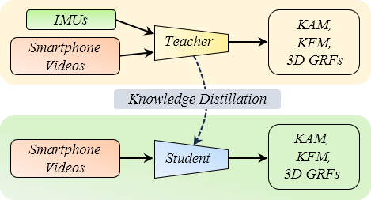
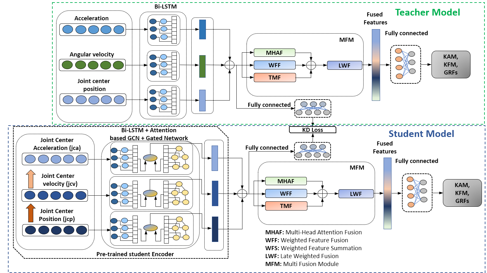

# Smartphone-Video-Based Knee Adduction, Knee flexion, and Ground Reaction Forces via Multi-modal Fusion and Knowledge Distillation

By Md Sanzid Bin Hossain, Hwan Choi,  Zhishan Guo, Hyunjun Shin, and Dexter Hadley

## Summary

  

This repository contains the code and models developed for estimating joint moments and 3D ground reaction forces (GRFs) using smartphone video data. Our approach offers a **cost-effective** and **accessible alternative** to traditional methods that require expensive equipment like force plates and motion capture systems. By utilizing only 2-D joint center data obtained from smartphone videos, our novel deep learning model effectively estimates joint moments and GRFs without the need for inertial measurement units (IMUs).

To address the limitations of video-only data, we employ a **knowledge transfer and distillation process** from a teacher model that integrates IMU and video data, enhancing the performance of the video-only student model. Additionally, we incorporate 2-D joint center velocity and acceleration into a **multi-modal fusion framework** to further improve estimation accuracy.

Our results demonstrate a significant reduction in **normalized root mean square error (NRMSE)** and an increase in **Pearson correlation coefficient (PCC)**, underscoring the effectiveness of the proposed method. The models achieve:

- **Student Model (Video-Only):** 
  - NRMSE reduced from **5.71** to **4.68**
  - PCC increased from **0.929** to **0.951**
  
- **Teacher Model (IMUs + Video):**
  - NRMSE reduced from **4.38** to **3.63**
  - PCC increased from **0.961** to **0.971**

Explore the code and models to implement this advanced, accessible solution for biomechanical analysis using just smartphone videos.

  

## Model Overview
Our proposed approach of knowledge distillation with a teacher and student model. Initially, a teacher model is trained, followed by pre-training the student model's encoder using Knowledge Distillation (KD) loss, leveraging the trained teacher model's encoder. Subsequently, a pre-trained student encoder is coupled with MFM and then fine-tuned to obtain the student model.

  

 

## Dataset
We use previously available public dataset [1] and pre-process data to fit our approach. Data can be found in the [Google Drive Link](https://drive.google.com/file/d/1fbI5252kg36XNQcoraX7JmYFHzAstNuz/view?usp=sharing)

 

## Codes

- [Google Colab notebook](Video_based_KAM_KFM_3D_GRFs.ipynb) to run initial model ablation, multi-modal fusion, knowledge distillation, vanilla knowledge distillation.

- [Google Colab notebook](SOTA_Smartphone_based_KAM_KFM_3D_GRFs.ipynb) to run state-of-the-art(SOTA) models that are used to compared with our proposed method

  

## References
[1] T. Tan, D. Wang, P. B. Shull, and E. Halilaj, “Imu and smartphone camera fusion for knee adduction and knee flexion moment estimation during walking,” IEEE Transactions on Industrial Informatics, 2022

