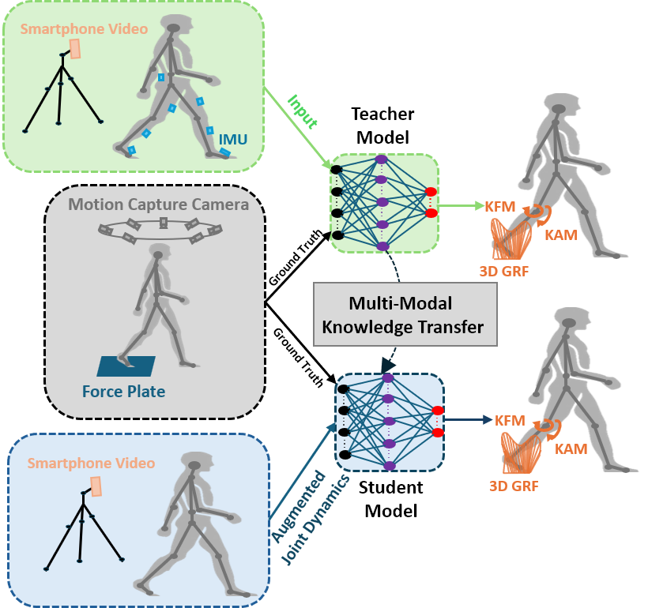
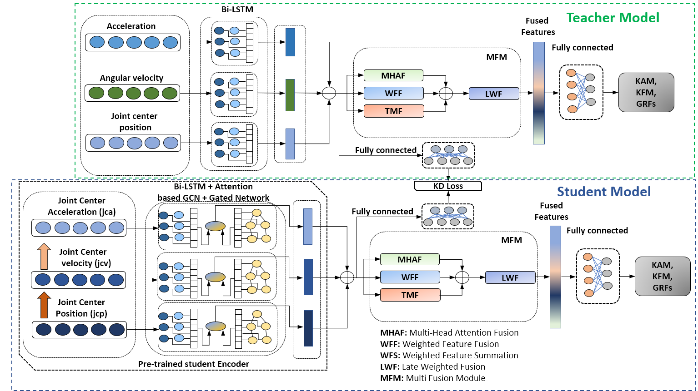

# Knowledge Transfer-Driven Estimation of Knee Moments and Ground Reaction Forces from Smartphone Videos via Temporal-Spatial Modeling of Augmented Joint Dynamics

By Md Sanzid Bin Hossain, Hwan Choi, Zhishan Guo, Sunyong Yoo, Min-Keun Song, Hyunjun Shin, and Dexter Hadley

## Summary

  

This repository contains the code and models developed for estimating joint moments and 3D ground reaction forces (GRFs) using smartphone video data. Our approach offers a **cost-effective** and **accessible alternative** to traditional methods that require expensive equipment like force plates and motion capture systems. By utilizing only 2-D joint center data obtained from smartphone videos, our novel deep learning model effectively estimates joint moments and GRFs without the need for inertial measurement units (IMUs).

To address the limitations of video-only data, we employ a **multi-modal knowledge transfer** from a teacher model that integrates IMU and video data to a video-only student model, enhancing the prediction outcome. Additionally, we utilize augmented dynamics of 2-D joint center position data and utilize temporal-spatial modeling of these augmented dynamics. 

Our results demonstrate a significant reduction in **normalized root mean square error (NRMSE)** and an increase in **Pearson correlation coefficient (PCC)**, underscoring the effectiveness of the proposed method. The models achieve:

- **Student Model (Video-Only):** 
  - NRMSE reduced from **5.71** to **4.68**
  - PCC increased from **0.929** to **0.951**
  
- **Teacher Model (IMUs + Video):**
  - NRMSE reduced from **4.38** to **3.63**
  - PCC increased from **0.961** to **0.971**

Explore the code and models to implement this advanced, accessible solution for biomechanical analysis using just smartphone videos.

  

## Model Overview
Overview of the proposed multi-modal knowledge transfer approach. A teacher model trained with input from IMUs and smartphone videos transfers knowledge to a student model trained with the augmented joint dynamics acquired from smartphone videos to estimate KAM, KFM, and 3D GRFs. The teacher model workflow is shown in green, while the student model workflow is represented in blue

  

 

## Dataset
We use previously available public dataset [1] and pre-process data to fit our approach. Data can be found in the [Google Drive Link](https://drive.google.com/file/d/1fbI5252kg36XNQcoraX7JmYFHzAstNuz/view?usp=sharing)

 

## Codes

- [Google Colab notebook](Video_based_KAM_KFM_3D_GRFs.ipynb) to run **initial model ablation, multi-modal fusion, knowledge distillation, vanilla knowledge distillation**

- [Google Colab notebook](SOTA_Smartphone_based_KAM_KFM_3D_GRFs.ipynb) to run **state-of-the-art(SOTA) models that are used to compared with our proposed method**

  

## References
[1] T. Tan, D. Wang, P. B. Shull, and E. Halilaj, “Imu and smartphone camera fusion for knee adduction and knee flexion moment estimation during walking,” IEEE Transactions on Industrial Informatics, 2022

